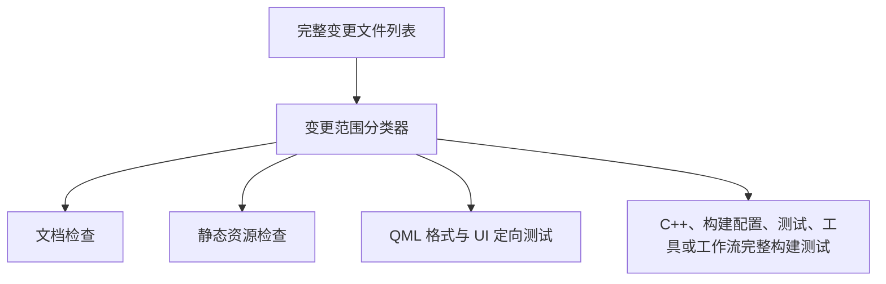

# GitHub Actions 工作流依赖关系

## 工作流分类

### 持续集成 (CI)
- `build.yml` - 构建和测试 (所有平台)
- `docs-check.yml` - MkDocs 文档构建检查
- `actionlint.yml` - GitHub Actions 工作流检查
- `clang-format.yml` - 代码格式检查
- `comment-policy.yml` - 源码注释率与注释策略检查
- `security.yml` - 安全检查

### 持续部署 (CD)
- `pack-linux.yml` - Linux 打包
- `pack-macos.yml` - macOS 打包
- `pack-windows.yml` - Windows 打包
- `release.yml` - 汇总各平台打包产物并发布 GitHub Release
- `deploy-docs.yml` - 文档部署

### 自动化与辅助
- `issue-triage.yaml` - Issue 自动分类
- `label.yml` - PR 自动标签
- `pr-review.yml` - PR 自动审查
- `.github/actions/setup-env` - 环境配置 Composite Action
- `.github/actions/get-version` - 版本号提取 Composite Action (新增)

## 全局策略

### 并发控制 (Concurrency)
主要 CI/CD 工作流配置了并发控制组 (`group: ${{ github.workflow }}-${{ github.ref }}`)。构建和打包工作流会在同一分支或标签有新运行时取消旧运行以节省资源；`release.yml` 不自动取消，避免发布过程被后续手动重跑中断。

### 权限控制 (Permissions)
遵循最小权限原则，每个工作流显式声明所需的 `GITHUB_TOKEN` 权限（例如 `contents: read` 或 `contents: write`）。

### 按变更范围选择检查

PR 工作流始终触发，再由 `tools/python/classify_ci_changes.py` 根据目标分支到 PR HEAD 的完整 diff
选择检查。分类器使用 `git diff --name-status -z --find-renames --find-copies`，因此删除和重命名文件的
两个路径都会参与判断；无法取得 base/head SHA、无法读取完整 diff 或无法识别路径时，统一回退到完整验证。

分类规则如下：

- 仅 Markdown、文档目录或文档模板变更：保留文档构建，不运行平台 C++ 构建和 CTest。
- 仅独立静态资源变更：运行资源完整性检查，不运行无关 C++ 构建。
- 仅 `src/ui/qml/` 下的 QML 变更：运行 QML 格式检查和 Linux UI 定向测试。
- C++、头文件、CMake、依赖、一般测试、Python 工具、打包配置或 `.github/workflows/**`、`.github/actions/**`
  变更：运行完整平台构建和测试。仅当变更严格限定为
  `tools/python/classify_ci_changes.py` 和/或
  `tests/python/test_classify_ci_changes.py` 时，运行分类器定向测试，不触发平台构建；这两个文件与其他代码、测试或工具
  混合变更时仍回退到完整验证。
- 跨类型变更：同时运行所有适用检查；只要包含无法安全分类的路径，就执行完整验证。

`docs-check.yml`、`comment-policy.yml` 仍会为每个 PR 产生稳定状态；`build.yml`、`clang-format.yml` 和
`actionlint.yml` 即使没有相关变更也会触发工作流，并将跳过的 job 收敛为成功状态，避免 required check
因 workflow 级 `paths` 过滤而长期处于 pending。分支保护使用的具体 job 名称必须以 GitHub 实际检查结果为准，
本文件不擅自修改远端分支保护规则。

## 触发条件

| 工作流 | Push | PR | Tag | Schedule | Manual |
|--------|------|-----|-----|----------|--------|
| build.yml | ✓ | ✓ | ✗ | ✗ | ✓ |
| actionlint.yml | ✓ | ✓ | ✗ | ✗ | ✓ |
| clang-format.yml | ✓ | ✓ | ✗ | ✗ | ✓ |
| comment-policy.yml | ✗ | ✓ | ✗ | ✗ | ✗ |
| security.yml | ✗ | ✓ | ✗ | ✓ | ✗ |
| pack-linux.yml | ✗ | ✗ | ✓ | ✗ | ✓ |
| pack-macos.yml | ✗ | ✗ | ✓ | ✗ | ✓ |
| pack-windows.yml | ✗ | ✗ | ✓ | ✗ | ✓ |
| release.yml | ✗ | ✗ | ✓ | ✗ | ✓ |
| deploy-docs.yml | ✓ | ✗ | ✗ | ✗ | ✓ |

## 超时配置

| 工作流 | 超时时间 |
|--------|----------|
| build.yml (Linux) | 60 分钟 |
| build.yml (Windows) | 90 分钟 |
| build.yml (macOS) | 75 分钟 |
| release.yml | 180 分钟 |
| pack-windows.yml | 120 分钟 |
