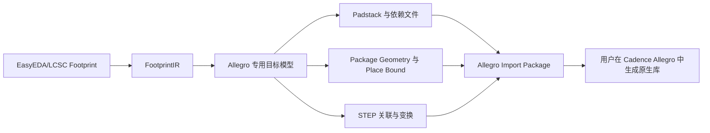

# Allegro PCB 封装导出

## 范围

当前功能只支持 **EasyEDA/LCSC Footprint → Allegro PCB Footprint Import Package**。它不生成 Cadence 私有的 `.dra`、`.psm` 或 `.pad` 数据库，也不支持 Allegro 原理图 Symbol、Capture `.olb` 或完整 Component Library。

## 输出目录

导出 `MyLib` 时生成 `MyLib_Allegro/`，包括 `manifest.json`、`generator.il`、`README_ALLEGRO.md`、`normalized-data/`、`padstacks/`、`shapes/` 和 `models/`。`manifest.json` 是唯一的包入口索引，并列出每个封装、Pin、Padstack 和 STEP 文件。

## 语义和降级

- 相同 Pad 几何、钻孔、槽孔、镀层、层行为、旋转和异形顶点会复用稳定的 Padstack。
- 独立安装孔作为机械几何输出，不会伪造电气 Pin。
- 重复或空 Pin 编号、无效 Shape 引用和无法映射的层会阻断导出。
- 当前 IR 没有独立的阻焊/锡膏扩展字段；包中会明确写出该限制，不会伪造工艺数据。
- 没有可靠 Place Bound 时使用焊盘包围盒回退，并在诊断中提示。
- STEP 的平移、旋转、偏移和坐标系说明会写入规范化 JSON；模型文件只在 IR 包含有效 STEP 数据时生成。

## 使用方式和限制

GUI 选择 `Allegro PCB`，CLI 使用 `--target-format allegro`。第一阶段只允许完整覆盖导出，不支持已有包的更新、追加或重试。执行 `generator.il` 只是导入包入口提示和验证入口，实际 `.dra/.psm/.pad` 生成需要用户安装并使用目标 Cadence Allegro 版本配置 `PSMPATH`、`PADPATH` 和 `steppath`。

当前开发环境未检测到可用于自动打开、保存和回读 Allegro 数据库的目标软件，因此本项目只验证 Import Package 结构、JSON 引用和文件完整性，不宣称完成 Allegro 实机兼容性验证。

Native `.dra/.psm/.pad` 的格式事实、公开样本观察和未确认字段请参阅 [Allegro Native 格式研究](ALLEGRO_NATIVE_FORMAT_RESEARCH.md)。在取得固定 Cadence 版本的真实样本并完成打开、保存、回读验证前，不应将 Import Package 当作 Native Library Export。
