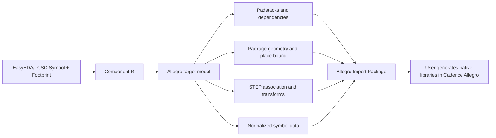

# Allegro semantic library Import Package export

## Scope

The current feature supports **EasyEDA/LCSC symbols and footprints to an Allegro semantic Import Package**. Symbols, footprints, pin-to-pad relations, and available STEP models are stored as normalized data. It does not write Cadence private `.dra`, `.psm`, or `.pad` databases, and it does not generate native Allegro schematic symbols or Capture `.olb` files.

## Output

Exporting `MyLib` creates `MyLib_Allegro/` with `manifest.json`, `generator.il`, `README_ALLEGRO.md`, `normalized-data/`, `symbols/`, `padstacks/`, `shapes/`, and `models/`. `manifest.json` is the package index and lists every symbol, footprint, pin, padstack, pin-to-pad relation, and STEP file.

## Semantics and degradation

- Padstacks are reused when geometry, drill, slot, plating, layer behavior, rotation, and custom vertices are equivalent.
- Standalone mounting holes are emitted as mechanical geometry and are never invented as electrical pins.
- Duplicate or empty pin numbers, invalid shape references, and unmappable layers stop the export.
- The current IR has no independent solder-mask or paste-expansion fields. The package records this limitation instead of fabricating manufacturing data.
- If no reliable place bound is present, a pad bounding-box fallback is emitted with a diagnostic.
- STEP translation, rotation, offset, and coordinate-system notes are recorded in normalized JSON; model files are written only when valid STEP data is present.

## Usage and limitations

Select `Allegro PCB` in the GUI or use `--target-format allegro` in the CLI. The first phase supports complete replacement export only; update, append, and retry modes are rejected. Load `generator.il` as the package entry point and configure `PSMPATH`, `PADPATH`, and `steppath` in the target Cadence Allegro environment. Native `.dra/.psm/.pad` generation remains a user-side Cadence operation.

No usable Allegro executable was detected in the development environment. The project therefore validates package structure, JSON references, and file completeness, but does not claim native Allegro compatibility validation.

See [Allegro Native Format Research](ALLEGRO_NATIVE_FORMAT_RESEARCH_en.md) for confirmed format facts, public sample observations, and unconfirmed fields. Until samples from a fixed Cadence version pass open, save, and reopen validation, the Import Package must not be treated as Native Library Export.
