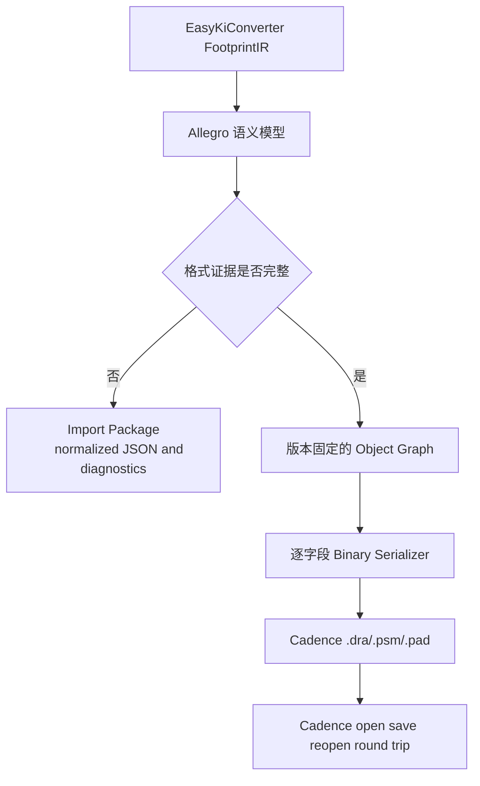

# Allegro Native 库格式研究

## 研究结论

本报告记录 EasyKiConverter 对 Allegro Native PCB 库格式的第一轮研究结果。当前结论是：项目可以安全生成 Allegro Import Package，但尚未具备在没有 Cadence 软件参与的情况下生成可验证 `.dra`、`.psm` 和 `.pad` 的证据链。因此本报告不把 Import Package 宣传为 Native Library Export。

研究依据包括 KiCad Allegro 导入器公开的逆向格式说明、OpenAllegroParser 的公开文档，以及 EasyKiConverter 当前 IR 和导出架构。KiCad 文档明确说明其内容不是官方规范，且 KiCad 当前仅支持 Allegro PCB 数据导入；OpenAllegroParser 也定位为二进制解析和 XML 导出工具。

## 证据范围

| 来源 | 已确认内容 | 不能直接推出的结论 |
| --- | --- | --- |
| KiCad `FORMAT.md` | `.brd` 文件头、版本魔数、字符串表、对象块、链表、图层编码、0x1C Padstack 和 0x28 Shape 的解析事实 | `.dra/.psm` 最小可写对象集合、所有版本的写入布局 |
| KiCad `allegro_parser.cpp` 与结构体 | 导入器读取字段的顺序、版本条件和引用关系 | 这些读取顺序可以直接作为 writer 的完整规范 |
| OpenAllegroParser | `.pad` 中可能包含 ZIP/JSON，Padstack Editor 支持 PXML，解析器的对象和部分动态字段 | `.pad` 的所有版本布局、合法写入字段和跨版本兼容性 |
| Cadence 实机 | 本环境未安装 Allegro 或 Padstack Editor | 文件能否打开、保存、回读和保持语义一致 |

## 公开样本观察

从公开的 `Werni2A/vlsicad_stm8_breakout_board` 仓库取得了研究副本，未将其二进制文件复制进 EasyKiConverter。该仓库说明其设计来自 Cadence Allegro 17.2，但样本头部与 KiCad 文档的版本描述仍需要进一步交叉验证，因此这里只记录可复现的字节事实：

| 文件 | 大小 | SHA-256 | 前 4 字节（文件原始顺序） |
| --- | ---: | --- | --- |
| `629105150521.dra` | 148 KiB | `885da2e3221187b5a7db7f691381ef2096ccb709e6926dc11145fbcdc3a35360` | `04 15 13 00` |
| `629105150521.psm` | 17 KiB | `3299025662d1b102c8c112199fc0f9424f2ac350115e5a6805a28b6ea100ec05` | `04 10 13 00` |
| `h_c80.pad` | 3.9 KiB | `c32a10fd2bf3ce1e01fdaa75c22c343edb0934c5403ea83f4c0956d72576eab0` | `04 10 13 00` |

观察结果：`.dra`、`.psm` 和 `.pad` 的头部并不相同；不能把 `.psm` 当作 `.dra` 改扩展名，也不能把 `.pad` 当作普通 ZIP 直接写出。`h_c80.pad` 这个公开样本中未发现 `PK 03 04` ZIP 签名，而 OpenAllegroParser 文档说明 ZIP/JSON 内嵌行为与文件版本有关。这进一步说明 Native writer 必须按固定版本和真实样本建立布局，而不能只实现一个通用文件头。

## Allegro 文件角色和版本

KiCad 公开说明记录了 16.x、17.2、17.4、17.5 和 18.x 的版本魔数，并指出 17.2 和 18.0 存在重要布局变化。`.dra` 文件角色值在 KiCad 研究文档中被标记为 `0x02`，但这仍属于逆向观察结果，不等于完整的 `.dra` 规范。

当前 C 阶段仍然缺少目标版本样本、字段闭包和 Cadence 回读验证，因此不能进入 E。

## 已确认的二进制事实

### 文件头和对象组织

- 文件头约为 4 KiB，包含 Magic、对象数量、版本、单位除数、字符串数量、图层映射和链表描述。
- 字符串表通常从固定偏移开始，由整数 ID 和空结尾字符串组成。
- 对象块以 1 字节类型标识开头，使用全局 Object Key 建立引用。
- 多数对象通过 `Next` Key 组成单向链表，头部记录链表头尾。
- 文件版本会改变字段是否存在和字段布局，尤其是 17.2 与 18.0。

### Padstack 和 Shape

- 0x1C Padstack 包含固定技术层槽位和按铜层数量变化的组件。
- Pad 组件、Antipad 和 Thermal Relief 具有不同槽位语义。
- 自定义 Shape 通过 Shape Symbol 引用 0x28 Polygon，Polygon 又引用线段和圆弧链。
- 槽孔、Mask、Paste、Thermal 和多层行为不是单一宽高字段可以完整表达的。

### 图层

KiCad 研究资料记录了 PACKAGE_GEOMETRY、PACKAGE_KEEPOUT、PIN、REF_DES、ETCH 等 Class，以及 Place Bound、Silkscreen、Assembly 等 Subclass。低值 Subclass 还可能索引文件头的自定义图层列表，因此不能只写死一个字符串或数字映射。

## EasyKiConverter 映射表

| EasyKiConverter 对象 | Allegro 语义目标 | Native Block | 当前状态 |
| --- | --- | --- | --- |
| `FootprintComponentIR` | Footprint Definition | 0x2B/相关 Definition 对象 | 语义模型已具备，二进制布局未确认 |
| `FootprintPadIR` | Pin、Padstack Assignment | 0x08、0x0C、0x0D、0x29、0x32 | 关联关系可建模，Native 引用布局未确认 |
| Pad 几何 | Padstack Component | 0x1C | 形状语义可映射，版本字段未闭合 |
| Polygon Pad | Shape Symbol | 0x28 与 Segment 链 | 只能在真实样本中确认引用和链表 |
| Line、Arc、Rectangle | Package Geometry | 0x14、0x15/16/17、0x24、0x01 | 读取端有线索，writer 最小集合未验证 |
| Text、REFDES | Text/String Graphic | 0x30、0x31 | 字符串引用和父对象关系未确认 |
| Place Bound | PACKAGE_GEOMETRY Subclass | 0x28 或相关 Graphic | 语义映射已存在，Native 编码未确认 |
| STEP | Definition Field 0x345/0x346 | 0x03 Field chain | 读取端记录了字段语义，写入端版本行为未验证 |

## 当前 Import Package 原型

当前 `src/core/allegro/ExporterAllegroFootprint.cpp` 生成以下安全原型：

- `normalized-data/` 保存 Allegro 专用语义模型；
- `padstacks/` 保存稳定去重后的 Padstack 描述；
- `shapes/` 保存 Polygon、Trapezoid 和 RoundRect 等依赖；
- `models/` 保存 STEP 和变换描述；
- `manifest.json` 保存引用和诊断入口；
- `generator.il` 和 `README_ALLEGRO.md` 说明需要用户在目标 Cadence 环境完成 Native 生成。

该原型验证了 IR 到 Allegro 语义模型的边界，但不生成 Native 数据库，也不假设 `generator.il` 能跨版本替代 Cadence 官方工具。

## 尚缺少的必要证据

在实现 Binary Writer 之前必须补齐：

1. 固定一个目标 Allegro 版本，并取得该版本由同一 Cadence 环境实际生成的最小 `.dra`、`.psm` 和 `.pad`；公开样本只能用于研究，不能替代目标环境样本。
2. 使用单变量样本比较 Header、String Table、Object Block、Key、Next、Parent 和 Layer 字段。
3. 获得 Cadence 打开、保存、重新打开的结果，确认没有 database corruption 或自动修复。
4. 用 KiCad 和 OpenAllegroParser 做读取校验，并记录它们未覆盖的字段。
5. 对 PXML、Native `.pad` 和 Allegro 版本之间的转换关系建立可复现测试。

在这些证据出现之前，任何 Native `.dra/.psm/.pad` writer 都会包含未经确认的格式猜测，不应合入产品。

## 验证状态

- EasyKiConverter Import Package：已通过本地结构、引用和回归测试。
- KiCad Allegro parser：已用于研究公开 `.dra/.psm` 的结构文档；尚未对 EasyKiConverter 生成文件执行验证，因为当前输出不是 `.brd/.dra`。
- OpenAllegroParser：作为格式研究依据使用，未复制其代码。
- Cadence Allegro/Padstack Editor：当前环境未安装，未执行实机打开、保存或回读。
