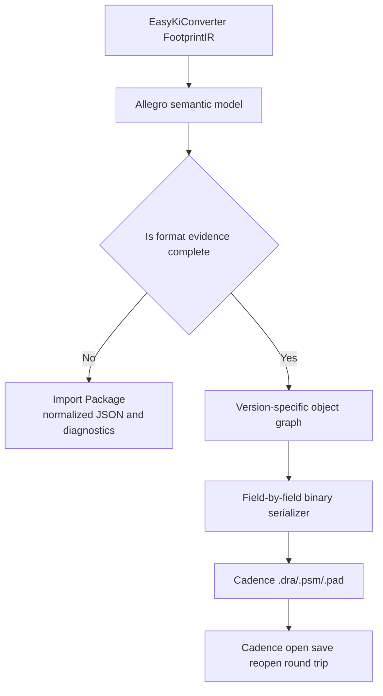

# Allegro Native Library Format Research

## Conclusion

This document records the first research pass for Allegro native PCB library files. EasyKiConverter can safely generate an Allegro Import Package, but the current evidence is not sufficient to generate verified `.dra`, `.psm`, and `.pad` files without Cadence participating in file generation. The Import Package must not be advertised as Native Library Export.

The research uses KiCad's public Allegro importer documentation, OpenAllegroParser's public documentation, and the current EasyKiConverter IR and exporter architecture. KiCad explicitly describes its format notes as reverse-engineered rather than official, and its current support is Allegro PCB import. OpenAllegroParser is likewise a binary parser and XML exporter.

## Evidence scope

| Source | Confirmed | Not proven |
| --- | --- | --- |
| KiCad `FORMAT.md` | File headers, version magic, strings, object blocks, linked lists, layer encoding, 0x1C padstacks and 0x28 shapes | The minimal writable object set for `.dra/.psm` and all version-specific write layouts |
| KiCad parser and structs | Read order, version conditions and references used by the importer | That importer read order is a complete writer specification |
| OpenAllegroParser | `.pad` may contain ZIP/JSON data, Padstack Editor supports PXML, and some dynamic fields are known | All `.pad` versions, legal write fields and cross-version compatibility |
| Cadence runtime | Allegro and Padstack Editor are not installed in this environment | Open, save, reopen and semantic round-trip behavior |

## Public sample observations

Research copies were obtained from the public `Werni2A/vlsicad_stm8_breakout_board` repository; its binary files were not copied into EasyKiConverter. The repository describes the design as Cadence Allegro 17.2, but the sample headers still require cross-checking against a target Cadence installation. The following reproducible byte facts are recorded:

| File | Size | SHA-256 | First 4 bytes in file order |
| --- | ---: | --- | --- |
| `629105150521.dra` | 148 KiB | `885da2e3221187b5a7db7f691381ef2096ccb709e6926dc11145fbcdc3a35360` | `04 15 13 00` |
| `629105150521.psm` | 17 KiB | `3299025662d1b102c8c112199fc0f9424f2ac350115e5a6805a28b6ea100ec05` | `04 10 13 00` |
| `h_c80.pad` | 3.9 KiB | `c32a10fd2bf3ce1e01fdaa75c22c343edb0934c5403ea83f4c0956d72576eab0` | `04 10 13 00` |

The `.dra`, `.psm` and `.pad` headers are different. A `.psm` cannot be treated as a renamed `.dra`, and a `.pad` cannot be emitted as an ordinary ZIP. The public `h_c80.pad` sample has no `PK 03 04` ZIP signature, while OpenAllegroParser documents embedded ZIP/JSON behavior as version-dependent. Native writing therefore requires a fixed version and target-environment samples rather than one guessed generic header.

Another public library, `taoyilee/PCB_LIB`, provides additional samples: `0805r.dra` starts with `03 0c 13 00`, `142-0771-821.dra` and its matching `.psm` start with `03 10 13 00`, while the matching `.pad` starts with `03 02 13 00`. Even within one public library, file roles have different header layouts; version and role cannot be inferred from the extension alone.

## File roles and versions

The public KiCad notes list version magic values for Allegro 16.x, 17.2, 17.4, 17.5 and 18.x, and identify major layout changes in 17.2 and 18.0. The `.dra` file role `0x02` is recorded as an observation in the KiCad research notes; it is not a complete `.dra` specification.

The current project is still at C because target-version samples, field closure and Cadence round-trip evidence are missing.

## Confirmed binary facts

### Header and object organization

- The header is approximately 4 KiB and contains magic, object count, version, unit divisor, string count, layer map and linked-list descriptors.
- The string table commonly starts at a fixed offset and consists of integer IDs followed by null-terminated strings.
- Object blocks start with a one-byte type tag and use global Object Keys for references.
- Most objects form singly linked lists through `Next` keys, with list heads and tails stored in the header.
- File versions change field presence and layout, especially between 17.2 and 18.0.

### Padstacks and shapes

- A 0x1C padstack contains fixed technical-layer slots and components varying with the copper-layer count.
- Pad, antipad and thermal-relief components have different slot semantics.
- Custom shapes use a Shape Symbol reference to a 0x28 polygon, which in turn references line and arc segments.
- Slot drills, masks, paste, thermal relief and multilayer behavior cannot be represented by a single width and height pair.

### Layers

The KiCad research records PACKAGE_GEOMETRY, PACKAGE_KEEPOUT, PIN, REF_DES and ETCH classes, with Place Bound, Silkscreen and Assembly subclasses. Low subclass values may index custom layer lists in the header, so a single hard-coded string or number is not sufficient.

## EasyKiConverter mapping

| EasyKiConverter object | Allegro semantic target | Native block | Current state |
| --- | --- | --- | --- |
| `FootprintComponentIR` | Footprint Definition | 0x2B and related definition objects | Semantic model exists; binary layout is unconfirmed |
| `FootprintPadIR` | Pin and Padstack Assignment | 0x08, 0x0C, 0x0D, 0x29, 0x32 | Relationships can be modeled; native references are unconfirmed |
| Pad geometry | Padstack Component | 0x1C | Shape semantics are mappable; version fields are incomplete |
| Polygon pad | Shape Symbol | 0x28 and segment chains | References and list topology require real samples |
| Line, arc, rectangle | Package Geometry | 0x14, 0x15/16/17, 0x24, 0x01 | Import-side clues exist; minimal writer set is unverified |
| Text and REFDES | Text/String Graphic | 0x30, 0x31 | String references and parent relations are unconfirmed |
| Place Bound | PACKAGE_GEOMETRY subclass | 0x28 or related graphics | Semantic mapping exists; native encoding is unconfirmed |
| STEP | Definition fields 0x345/0x346 | 0x03 field chain | Read-side meaning is recorded; write behavior is unverified |

## Current Import Package prototype

`src/core/allegro/ExporterAllegroFootprint.cpp` currently generates:

- `normalized-data/` for the Allegro semantic model;
- `padstacks/` for stable deduplicated padstack descriptions;
- `shapes/` for polygon, trapezoid and rounded-rectangle dependencies;
- `models/` for STEP files and transform descriptions;
- `manifest.json` for references and diagnostics;
- `generator.il` and `README_ALLEGRO.md` explaining that native generation must happen in the target Cadence environment.

This validates the IR-to-Allegro semantic boundary, but does not generate a native database or assume that `generator.il` can replace Cadence across versions.

## Generation paths intentionally excluded

Cadence's official application note provides a Padstack generation path through Allegro SKILL, including `axlDBCreatePadStack` and `axlPadstackToDisk`, and explains that saving a `.dra` can produce a `.psm`. This path has stronger evidence than direct binary reverse engineering, but it requires Cadence to execute and therefore does not satisfy the requirement that file generation work without Cadence. EasyKiConverter does not treat a SKILL backend as a substitute for a native binary writer.

Some third-party tools similarly generate scripts, invoke Padstack Designer, and then invoke Allegro to create `.dra/.psm`. They may be considered for a future Cadence-assisted backend, but they do not prove that EasyKiConverter has an independent native binary writer.

## Required missing evidence

Before implementing a binary writer, the project must obtain:

1. Minimal `.dra`, `.psm` and `.pad` files generated by one fixed Allegro version in the target Cadence environment; public samples are useful for research but cannot replace target-environment samples.
2. Single-variable comparisons of headers, string tables, blocks, keys, links, parents and layers.
3. Cadence open, save and reopen results proving there is no database corruption or automatic repair.
4. KiCad and OpenAllegroParser validation, including fields they do not cover.
5. Reproducible tests for PXML, native `.pad` and Allegro-version relationships.

Cadence documentation and script APIs can inform semantic and verification work, but cannot replace the native binary evidence above.

Until this evidence exists, a native writer would necessarily contain unverified format guesses and must not be merged as product functionality.

## Verification status

- EasyKiConverter Import Package: verified by local structure, reference and regression tests.
- KiCad Allegro parser: used for researching public `.dra/.psm` format documentation; not run against EasyKiConverter output because the output is not `.brd/.dra`.
- OpenAllegroParser: used as format research material; no code was copied.
- Cadence Allegro/Padstack Editor: not installed; no native open, save or round-trip validation was performed.
