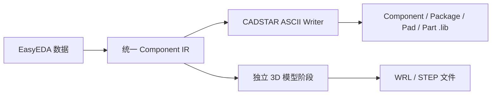

# CADSTAR ASCII 库导出

## 范围

当前 CADSTAR 目标输出的是可回读的 UTF-8 ASCII `.lib` 交换库，不是 CADSTAR 私有数据库。完整导出模式将符号、封装、Pad 定义和 Part 关联写入同一文件；独立 3D 阶段输出 WRL/STEP 文件，但不会伪造未经验证的 CADSTAR 私有模型关联。

## 已实现

- GUI 目标格式 `CADSTAR` 和 CLI `--target-format cadstar`。
- `ComponentIR` 到 CADSTAR `COMPONENT`、`PACKAGE`、`PAD`、`PART` 的转换。
- 仅启用封装导出时不强制读取符号缓存；符号和封装同时启用时才生成完整的 `COMPONENT`、`PACKAGE`、`PART` 关联库。
- 圆形、矩形、椭圆、槽孔和自定义多边形 Pad。
- 封装矩形、圆、折线和多边形图元。
- 符号引脚、矩形、圆和多边形图元。
- Pad 定义和相同封装的稳定复用。
- 输出后使用项目 CadstarParser 回读验证。
- 导出失败时拒绝无法表达的曲线、文本字体属性和不支持的焊盘形状。

## 限制与验证边界

- 当前环境未安装 CADSTAR，因此没有进行 CADSTAR 实机打开、保存和重新读取验证。
- 更新、追加和重试模式被拒绝，避免误覆盖或伪造合并语义。
- 3D 文件由独立阶段输出，`.lib` 不包含未经验证的私有 3D 关联。
- 圆弧、复杂曲线、字体属性和部分来源层语义暂不写入；这些情况会形成错误诊断，不会静默降级。
- 该输出应先在目标 CADSTAR 版本中打开并保存一份副本，再用于发布库。

实现只读取统一 IR，没有复制其他项目的 writer 代码。
