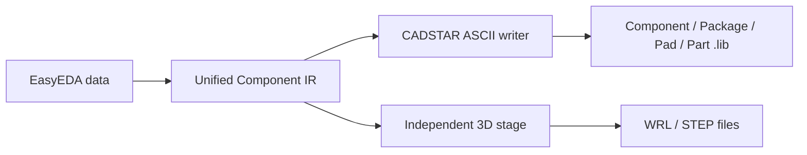

# CADSTAR ASCII library export

## Scope

The CADSTAR target currently writes a readable UTF-8 ASCII `.lib` exchange library, not a private CADSTAR database. Complete export writes symbols, footprints, Pad definitions, and Part associations in one file. The independent 3D stage emits WRL/STEP files but does not fabricate unverified private CADSTAR model links.

## Implemented

- GUI target `CADSTAR` and CLI `--target-format cadstar`.
- `ComponentIR` to CADSTAR `COMPONENT`, `PACKAGE`, `PAD`, and `PART` conversion.
- Round, rectangle, oval, slot-hole, and custom polygon Pads.
- Package rectangles, circles, polylines, and polygons.
- Symbol pins, rectangles, circles, and polygons.
- Stable Pad reuse and package reuse inside one library.
- Read-back validation through the project's CadstarParser.
- Export failure for curves, font-specific text, and unsupported Pad shapes that cannot be represented safely.

## Limits and validation boundary

- CADSTAR is not installed in the current environment, so native open, save, and reopen validation has not been performed.
- Update, append, and retry modes are rejected to avoid unsafe overwrite or fabricated merge semantics.
- 3D files are emitted by the independent stage; the `.lib` does not contain unverified private 3D links.
- Arcs, complex curves, font attributes, and some source-layer semantics are not written; they produce error diagnostics instead of silent degradation.
- The generated library should be opened and saved as a copy in the target CADSTAR version before release use.

The writer consumes the unified IR and does not copy writer code from another project.
