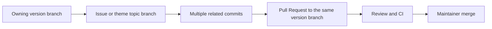

# Contributing Guide

Thank you for your interest in contributing to EasyKiConverter! This document provides guidelines for contributing to the project.

## Getting Started

### Prerequisites

Before contributing, make sure you:

1. Have read the project documentation:
   - [Project Architecture](ARCHITECTURE_en.md)
   - [Build Guide](BUILD_en.md)
   - [Features Documentation](../user/FEATURES_en.md)

2. Have successfully built the project locally

3. Are familiar with:
   - C++ programming language
   - Qt framework (Qt Quick, Qt Network, etc.)
   - CMake build system
   - MVVM architecture pattern
   - Git version control

## Setting Up Development Environment

### 1. Fork the Repository

1. Fork the repository on GitHub
2. Clone your fork locally:
   ```bash
   git clone https://github.com/YOUR_USERNAME/EasyKiConverter.git
   cd EasyKiConverter
   ```

### 2. Configure Remotes

Add the upstream repository:

```bash
git remote add upstream https://github.com/EasyKiconverter/EasyKiConverter.git
```

### 3. Create a Topic Branch from the Version Branch

Create one topic branch for a reasonably complete issue or development theme, starting from the version branch that owns the work:

```bash
git fetch upstream <version-branch>
git switch -c <topic-branch> --track upstream/<version-branch>
```

A topic branch may contain multiple related changes and commits. Do not create a branch for every small edit, subtask, or individual commit. The repository has no detected mandatory branch-name validator; names such as `fix/cache-safety-v3.1.13` and `feat/allegro-export-v3.1.13` are suggestions for clarity, not required formats.

In the Fork workflow, use `upstream` to fetch the canonical repository's version branch and use `origin` only to push your topic branch.

## Code Standards

### C++ Coding Standards

Follow Qt coding standards:

#### Naming Conventions

- **Class names**: PascalCase
  ```cpp
  class ComponentService { };
  ```

- **Function names**: camelCase
  ```cpp
  void loadData();
  ```

- **Variable names**: camelCase
  ```cpp
  int componentId;
  ```

- **Member variables**: m_ prefix, camelCase
  ```cpp
  int m_componentId;
  ```

- **Constants**: UPPER_SNAKE_CASE
  ```cpp
  const int MAX_RETRIES = 3;
  ```

#### File Organization

- Header files (.h) and implementation files (.cpp) should be separated
- Each class should have its own header and implementation file
- QML files should be organized by function module
- Resource files should be placed in the `resources/` directory

#### Comments

- Use Doxygen-style comments for classes and public methods
  ```cpp
  /**
   * @brief Loads component data from EasyEDA API
   * @param componentId The component ID to load
   * @return ComponentData The loaded component data
   */
  ComponentData loadComponent(const QString& componentId);
  ```

- Add inline comments for complex logic
  ```cpp
  // Calculate arc center using SVG arc parameters
  double centerX = ...;
  ```

#### C++ Features

- Use C++17 features
- Use smart pointers (QSharedPointer, QScopedPointer) for resource management
- Use Qt's signal-slot mechanism for object communication
- Follow RAII principles
- **File Encoding**: All source files (`.cpp`, `.h`, `.qml`, `CMakeLists.txt`, etc.) MUST use **UTF-8 (without BOM)** encoding. Encodings like UTF-8 with BOM or GBK are strictly prohibited.
- **Tool Validation**: Before submitting code, contributors MUST use the provided encoding conversion tool.
  - Path: `tools/python/convert_to_utf8.py`
  - Usage: `python tools/python/convert_to_utf8.py`
  - This tool ensures all files comply with the UTF-8 without BOM standard.

### QML Coding Standards

- **Component names**: PascalCase
  ```qml
  ModernButton { }
  ```

- **Property names**: camelCase
  ```qml
  property string componentId: ""
  ```

- **ID names**: camelCase
  ```qml
  Button { id: componentInput }
  ```

- **Code formatting**: 4-space indentation
- **Comments**: Use `//` for single-line comments

## Architecture Requirements

### MVVM Architecture

Follow the MVVM architecture pattern:

- **View Layer (QML)**: Responsible for UI display only
- **ViewModel Layer**: Manages UI state and business logic coordination
- **Service Layer**: Implements business logic
- **Model Layer**: Handles data storage

### Export Service Architecture

Use the two-stage pipeline architecture (Fetch → Export):

- **Fetch stage**: concurrent network tasks controlled by the shared network layer (currently 10)
- **Export stage**: builds IR, converts formats, and writes files in parallel
- See: [ADR-002: Pipeline Parallelism](../project/adr/002-pipeline-parallelism-for-export_en.md)

## Branch and Pull Request Workflow

The project organizes development by issue or theme; it does not use a fixed `feature/* → dev → master` flow. Create the topic branch from the version branch that owns the work, and open the Pull Request back to that same version branch. Do not commit directly to a version branch.



The maintainer determines the version branch, such as `v3.1.13`. Contributors must confirm it before creating the branch and must not assume that every change targets `master` or `dev`.

## Development Workflow

### 1. Make Changes

Make your changes following the code standards.

### 2. Test Your Changes

- Build the project successfully
- Run the application and test your changes

### 3. Commit Your Changes

Follow the commit message format:

```
<type>(<scope>): <subject>

<body>

<footer>
```

**Types**:
- `feat`: New feature
- `fix`: Bug fix
- `docs`: Documentation changes
- `style`: Code style changes (formatting, etc.)
- `refactor`: Code refactoring
- `test`: Test additions or changes
- `chore`: Build process or auxiliary tool changes

**Examples**:

```
feat(export): 修复封装解析

修复封装解析中的边界条件。

- 补充异常输入处理
- 增加对应回归测试
- 更新相关文档

Closes #123
```

```
fix(export): 修复封装解析错误

修复处理异形焊盘时的封装解析错误。

- 修正类型判断逻辑
- 增加边界框解析
- 修复标识提取问题

Fixes #456
```

### 4. Push to Your Fork

```bash
git push origin <topic-branch>
```

### 5. Create Pull Request

1. Go to the original repository on GitHub
2. Click "New Pull Request"
3. Select your topic branch and the same version branch used as its starting point
4. Fill in the PR template:
   - Description of changes
   - Related issues
   - Screenshots (if applicable)

### 6. Review and Iterate

- Address review comments
- Make necessary changes
- Update your PR

## Pull Request Guidelines

### Before Submitting

- [ ] Code follows project coding standards
- [ ] Code compiles without warnings
- [ ] Documentation is updated
- [ ] Commit messages are clear and follow the format

### PR Description Template

```markdown
## Description
Brief description of the changes

## Type of Change
- [ ] Bug fix
- [ ] New feature
- [ ] Breaking change
- [ ] Documentation update

## Related Issues
Closes #123

## Testing
Describe how you tested the changes

## Checklist
- [ ] Code follows project standards
- [ ] Documentation updated
- [ ] No new warnings
```

## Documentation

### When to Update Documentation

Update documentation when:
- Adding new features
- Changing existing functionality
- Modifying the API
- Fixing bugs that affect user behavior

### Documentation Standards

- Use clear, concise language
- Include code examples
- Add diagrams where helpful
- Keep documentation up to date

## Issue Reporting

### Before Reporting Issues

1. Search existing issues
2. Check if the issue is already fixed in the latest version
3. Try to reproduce the issue

### Issue Template

```markdown
## Description
Clear description of the issue

## Steps to Reproduce
1. Step 1
2. Step 2
3. Step 3

## Expected Behavior
What you expected to happen

## Actual Behavior
What actually happened

## Environment
- OS: [e.g., Windows 10]
- Qt Version: [e.g., 6.10.1]
- Application Version: [e.g., 3.0.0]

## Screenshots
If applicable, add screenshots

## Additional Context
Any other relevant information
```

## Code Review Process

### Reviewer Guidelines

- Check code follows project standards
- Verify functionality is correct
- Ensure tests are adequate
- Check documentation is updated

### Author Guidelines

- Respond to review comments promptly
- Make requested changes
- Explain your reasoning if you disagree

## Release Process

### Versioning

Follow semantic versioning: MAJOR.MINOR.PATCH

- MAJOR: Incompatible API changes
- MINOR: New functionality (backwards compatible)
- PATCH: Bug fixes (backwards compatible)

### Release Checklist

- [ ] Documentation is complete
- [ ] CHANGELOG is updated
- [ ] Version number is updated
- [ ] Release notes are prepared

## Community Guidelines

### Code of Conduct

- Be respectful and inclusive
- Provide constructive feedback
- Help others learn
- Focus on what is best for the community

### Communication

- Use GitHub Issues for bug reports and feature requests
- Use GitHub Discussions for questions and ideas
- Be patient with maintainers and other contributors

## Recognition

Contributors will be acknowledged in:
- Contributors list in README
- Release notes
- Project documentation

## License

By contributing to EasyKiConverter, you agree that your contributions will be licensed under the GNU General Public License v3.0 (GPL-3.0).

## Getting Help

If you need help:
1. Check existing documentation
2. Search GitHub Issues and Discussions
3. Create a new issue with your question

## Thank You

Thank you for contributing to EasyKiConverter! Your contributions help make this project better for everyone.
