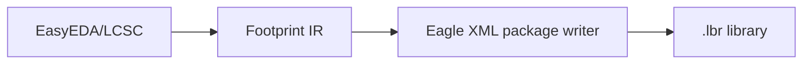

# Eagle XML 封装导出

当前支持 **EasyEDA/LCSC 封装 → Eagle XML `.lbr` package library**。此能力不等同于完整 Eagle 元件库：第一阶段不生成 symbol、device、variant 或三维模型关联。

## 已实现

- GUI 目标格式 `Eagle PCB`，CLI 目标格式 `--target-format eagle`。
- SMD、PTH、独立机械孔、圆、矩形、走线、区域和文本的基础 XML 输出。
- 顶/底铜、丝印、阻焊、锡膏、装配、Keepout 和机械层的保守映射。
- 清洗后的 package 名称冲突、空编号、非法数值、未知图层和未实现图元会产生失败诊断。
- 输出是单个 UTF-8 XML `.lbr` 文件；测试使用 Qt XML reader 回读结构。

## 限制与验证

- 当前不生成 Eagle symbol、device、完整元件库或 3D 模型关联。
- Polygon/Trapezoid/槽孔和圆弧不会被静默转换，当前会拒绝并说明原因。
- 当前环境没有 Eagle 实机，因此只完成 XML 结构回读和引用检查，未完成目标软件打开、保存和跨版本验证。
- 更新、追加和重试模式被导出阶段拒绝；已有文件在关闭覆盖时不会被替换。

