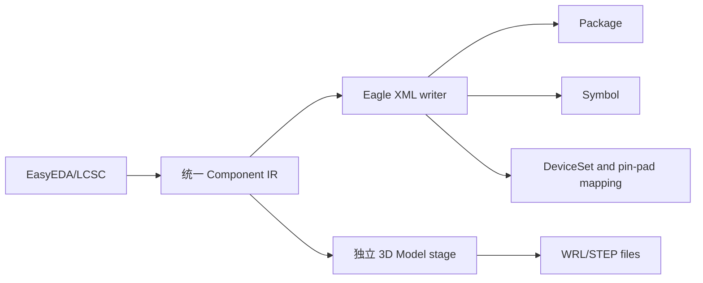

# Eagle XML 组合库导出

当前支持 **EasyEDA/LCSC → Eagle XML `.lbr` 库**：可按选择输出完整组合库、仅符号库或仅封装库。完整组合库在同一文件中写入封装、符号、DeviceSet 和引脚到焊盘的关联，因此不是仅封装库导出。三维模型仍由独立模型阶段输出；由于 Eagle `package3d` 依赖受管 URN，本项目不会伪造托管关联。

## 已实现

- GUI 目标格式 `Eagle PCB`，CLI 目标格式 `--target-format eagle`。
- SMD、PTH、独立机械孔、圆、矩形、走线、区域和文本的基础 XML 输出。
- 在同时启用符号和封装导出时，写入 Symbol、DeviceSet、Gate、Device 和 Connect 关联；多部件符号按 Gate 输出。
- 仅启用封装导出时写入 package-only XML；只有同时启用符号和封装时才要求两类缓存并写入 DeviceSet 关联。
- 仅启用符号导出时写入 symbol-only XML；该文件不包含 Package、DeviceSet 或 Pin-to-Pad 关联。
- 启用 3D 导出时，独立阶段输出 WRL/STEP 文件并生成可见诊断；`.lbr` 不写入未经验证的 `package3d` 托管 URN。
- 顶/底铜、丝印、阻焊、锡膏、装配、Keepout 和机械层的保守映射。
- 清洗后的 package 名称冲突、空编号、非法数值、未知图层和未实现图元会产生失败诊断。
- 输出是单个 UTF-8 XML `.lbr` 文件；测试使用 Qt XML reader 回读结构。

## 限制与验证

- 当前不生成 Eagle 托管 `package3d`、variant 或基于 URN 的三维关联。
- 可由 Eagle XML `wire` 表达的符号三点圆弧和封装圆弧会写入 `curve` 属性；符号路径曲线、无法确定圆弧几何的输入会拒绝导出，而不是静默降级。
- Polygon、Trapezoid 和槽孔等当前无法由本 writer 无损表达的焊盘几何会拒绝并说明原因；圆弧不属于该拒绝范围。
- 符号图元的填充、虚线和点线样式无法由当前 XML writer 无损表达时会失败并生成诊断，不会退化为实线。
- 封装旋转矩形会转换为旋转后的 wire 端点；非圆形通孔、点数不足的走线或区域会失败并生成诊断，不会被压成圆形或静默跳过。
- 当前环境没有 Eagle 实机，因此只完成 XML 结构回读和引用检查，未完成目标软件打开、保存和跨版本验证。
- 更新、追加和重试模式被导出阶段拒绝；已有文件在关闭覆盖时不会被替换。
