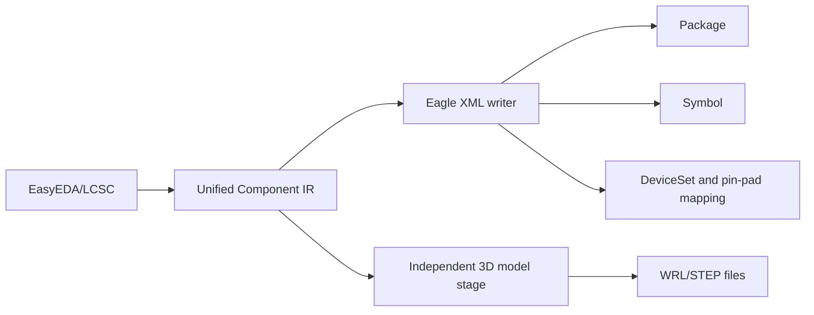

# Eagle XML Combined Library Export

The current scope is **EasyEDA/LCSC to an Eagle XML `.lbr` library**: the selection can produce a complete combined library, a symbol-only library, or a package-only library. The complete library contains packages, symbols, DeviceSets, and pin-to-pad connections in one file, so this is not limited to footprint export. 3D files are emitted by the independent model stage; managed Eagle `package3d` associations are not fabricated because they require managed URNs.

## Implemented

- GUI target `Eagle PCB` and CLI target `--target-format eagle`.
- Basic XML output for SMD, PTH, independent mechanical holes, circles, rectangles, tracks, regions, and text.
- When symbol and footprint export are enabled, symbols, DeviceSets, gates, devices, and pin-to-pad connections are written; multi-part symbols are emitted as separate gates.
- Footprint-only selection writes a package-only XML library; symbol and footprint cache data are both required only for a complete DeviceSet association library.
- Symbol-only selection writes a symbol-only XML library; it does not contain packages, DeviceSets, or pin-to-pad connections.
- When 3D export is enabled, the independent stage emits WRL/STEP files and reports the result; the `.lbr` does not contain an unverified managed `package3d` URN.
- Conservative mapping for top/bottom copper, silkscreen, mask, paste, assembly, keepout, and mechanical layers.
- Sanitized package-name collisions, empty pin numbers, invalid values, unknown layers, and unsupported primitives produce failure diagnostics.
- A single UTF-8 XML `.lbr` file is emitted and read back with Qt's XML reader in tests.

## Limitations and validation

- Managed Eagle `package3d`, variants, and URN-based 3D associations are not generated.
- Symbol three-point arcs and package arcs that can be represented by an Eagle XML `wire` are written with the `curve` attribute; symbol path curves and geometries with indeterminate arc semantics are rejected instead of silently downgraded.
- Polygon, Trapezoid, and slot pad geometries that the current writer cannot represent losslessly are rejected with diagnostics; arcs are supported within the stated mapping.
- Filled, dashed, and dotted symbol styles that the current XML writer cannot represent losslessly are rejected with diagnostics instead of being downgraded to solid strokes.
- Rotated package rectangles are emitted with rotated wire endpoints; non-circular through-hole pads and underspecified tracks or regions are rejected with diagnostics instead of being rounded or silently skipped.
- Eagle is not installed in the current environment; XML structure and reference checks are covered, but no target-software open/save or cross-version validation has been performed.
- Update, append, and retry modes are rejected; an existing file is not replaced when overwrite is disabled.
