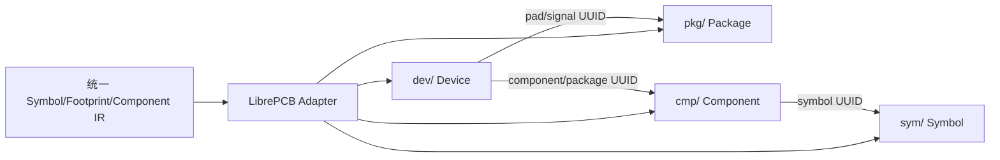

# LibrePCB 原生库导出

> 当前状态：已接入 CLI 和 GUI 目标选择。已使用 LibrePCB 2.1.1 官方 CLI 完成目录解析、严格检查和保存回读验证；LibrePCB 桌面应用中的导入与语义核对仍未完成。

当前实现目标为 LibrePCB 2.1.1（文件格式版本 2）的目录型 `.lplib` 库。导出器只读取统一 IR，不把 LibrePCB 字段写入通用 IR。



## 当前实现

- 生成 `.librepcb-lib`、`library.lp` 以及 `sym`、`pkg`、`cmp`、`dev` 元素目录。
- 生成稳定 UUID，并建立符号引脚、封装焊盘、组件信号和器件焊盘映射。
- 支持可由当前 IR 准确表达的基本矩形、圆形、多边形、折线、文本、可表达的矩形/圆形焊盘和自定义多边形焊盘；圆弧、椭圆及 Bézier 图元会在诊断中说明离散化降级。
- 对重复焊盘/引脚编号、名称清理冲突、缺失符号或封装关联、追加/更新模式和不可表达形状返回诊断并拒绝导出。
- 当启用三维导出且 IR 中有 STEP/OBJ 数据时，将模型复制到对应 `pkg/<package-uuid>/` 目录并写入包与 footprint 关联；OBJ 仅作兼容性警告，目标环境是否接受仍需验证。
- 对无法进入 LibrePCB 库语义的网络名、锁定状态、隐藏参数、别名和图元顺序输出明确诊断，不静默伪造目标数据。

## 输出路径与库发现

导出结果是目录型库，目录名称必须以 `.lplib` 结尾。输出路径有两种行为：

- 选择 LibrePCB 项目根目录，或该项目的 `library/` 目录：程序会识别项目标记，并写入项目库；如果能继续找到包含 `data/libraries/` 和 `projects/` 的 Workspace，还会将库安装到 `data/libraries/local/`。
- 选择普通目录：程序只生成 `<输出目录>/<库名称>.lplib/`，不会修改任何 Workspace。要在 LibrePCB 中使用它，请将整个 `.lplib` 目录复制到 Workspace 的 `data/libraries/local/`，或通过 LibrePCB 库管理器添加本地库。

导出后 LibrePCB 可能需要后台建立库索引。索引完成前，库或器件可能暂时不会出现在选择列表中。只导出 Package 不会产生可用于“添加元器件”的 Component/Device，完整器件需要同时导出符号、封装和关联数据。

## 明确限制

- 当前 IR 没有圆角半径，`RoundRect` 不会静默降级为矩形，而是拒绝导出。
- 非圆椭圆、Oval 和缺少有效顶点的梯形/多边形焊盘会拒绝导出。
- 多部件符号尚未实现安全拆分。
- GUI 和 CLI 均可选择 LibrePCB；GUI 使用通用导出设置卡片，实际输出为 `.lplib` 目录。桌面应用语义回读尚未完成，因此复杂图元和三维数据仍应以诊断和 CLI 检查结果为准。
- 已验证：LibrePCB 2.1.1 官方 `librepcb-cli open-library --all --save` 能打开并保存本导出器生成的完整测试库；保存后的库可再次被 CLI 读取。
- 已验证：包含封装外形回退、STEP 模型和制造商料号的测试库通过 `open-library --all --check --strict`，退出状态为 0。没有 3D 模型或制造商料号的真实输入仍可能得到 LibrePCB 的提示，这不表示导出器替用户补造这些信息。
- 尚未验证：LibrePCB 桌面应用打开、编辑、保存后的语义回读，以及真实器件库中所有图元的视觉和电气交互。

## 图层与降级策略

封装图层使用显式映射，不经过 KiCad 图层中间层：`TopSilk/BottomSilk` 映射到 Legend，`TopAssembly/BottomAssembly`
映射到 Documentation，`EdgeCuts` 映射到 Package Outlines，Mask/Paste 映射到对应 Stop Mask/Solder Paste 图层。
LibrePCB 没有与 KeepOut 区域等价的 Package 图元，因此遇到 KeepOut 会失败；缺少可靠外形或 courtyard 时只根据已知 IR
边界生成回退图形，并在诊断中说明。

符号引脚坐标必须落在 LibrePCB 2.1.1 固定的 2.54 mm 原理图栅格上，否则导出失败。单位均按 IR 的毫米值写入，模型文件
复制到 Package 元素目录并通过稳定 UUID 关联。

## 验证依据

格式依据 LibrePCB 官方仓库 `LibrePCB/LibrePCB` tag `2.1.1`，commit `06465bf12659a2c20464b3389929a28427d28ad7`，文件格式版本为 `2`。关键实现位于官方 `libs/librepcb/core/library/` 和 `tests/cli/open_library/`。

本项目的 `test_librepcb_exporter` 验证目录、版本标记、元素文件、UUID 关系和失败诊断；目标应用/官方 CLI 回读结果必须单独记录，不得由上述测试推断。

设置 `LIBREPCB_CLI` 后，定向测试会自动执行官方 CLI 集成验证：

```bash
QT_QPA_PLATFORM=offscreen \
LIBREPCB_CLI=/path/to/librepcb-cli \
./build/bin/test_librepcb_exporter validatesWithLibrePcbCli
```

该测试依次执行 `open-library --all --save`、`--check` 和 `--check --strict`。未设置环境变量时，集成用例会跳过，
不会把缺少外部 LibrePCB 安装误报为通过。
