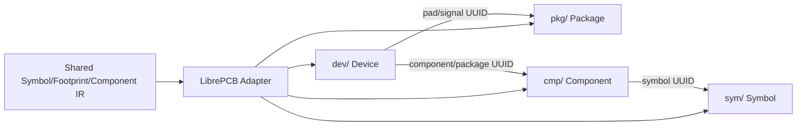

# LibrePCB Native Library Export

> Status: available through the CLI and GUI target selector. The official LibrePCB 2.1.1 CLI has validated parsing, strict checking, and save/reload of the generated library; desktop application import and semantic checks are still pending.

The current implementation targets the LibrePCB 2.1.1 directory-based `.lplib` format (file format version 2). The exporter consumes the shared IR and keeps LibrePCB-specific fields out of the generic IR.



## Implemented so far

- Writes `.librepcb-lib`, `library.lp`, and element directories for `sym`, `pkg`, `cmp`, and `dev`.
- Generates stable UUIDs and connects symbol pins, package pads, component signals, and device pad mappings.
- Supports basic rectangles, circles, polygons, polylines, text, representable rectangular/circular pads, and custom polygon pads. Arcs, ellipses, and Bézier primitives are discretized with an explicit diagnostic.
- Rejects duplicate pad/pin numbers, sanitized-name collisions, missing symbol/package associations, append/update modes, and unrepresentable pad shapes with diagnostics.
- When 3D export is enabled and the IR contains STEP/OBJ data, copies the model into `pkg/<package-uuid>/` and writes package/footprint references. OBJ output is warning-level only and still requires target validation.
- Emits explicit diagnostics for net names, lock state, hidden parameters, aliases, and graphic order which cannot be represented as LibrePCB library semantics, instead of silently fabricating target data.

## Output Paths and Library Discovery

The output is a directory-based library, and the directory name must end with `.lplib`. The output path has two behaviors:

- If the selected path is a LibrePCB project root or its `library/` directory, the exporter detects the project marker and writes the project library. If it can also find a Workspace containing `data/libraries/` and `projects/`, it installs a copy into `data/libraries/local/`.
- If the selected path is an ordinary directory, the exporter only creates `<output directory>/<library name>.lplib/` and does not modify any Workspace. To use it in LibrePCB, copy the complete `.lplib` directory into the Workspace's `data/libraries/local/` directory or add it through the LibrePCB library manager.

After export, LibrePCB may need to build its library index in the background. The library or devices may not appear in selectors until indexing completes. Exporting only a Package does not create a Component/Device available in the “Add Component” dialog; a complete device requires the symbol, package, and association data to be exported together.

## Explicit limitations

- The current IR does not retain a pad corner radius, so `RoundRect` is rejected rather than silently flattened to a rectangle.
- Non-circular ellipses, oval pads, and trapezoid/polygon pads without valid vertices are rejected.
- Safe multi-part symbol splitting is not implemented.
- LibrePCB is available from both the GUI and CLI. The GUI uses the shared export settings card and produces a `.lplib` directory. Desktop semantic round-trip validation is still pending, so complex graphics and 3D data remain subject to the documented diagnostics and CLI checks.
- Verified: LibrePCB 2.1.1 `librepcb-cli open-library --all --save` opens and saves the complete test library generated by this exporter, and the saved library can be read again by the CLI.
- Verified: the test library with a fallback package outline, STEP model, and manufacturer part number passes `open-library --all --check --strict` with exit status 0. Real inputs without a 3D model or manufacturer part number may still produce LibrePCB hints; the exporter does not invent those source facts.
- Not verified: opening, editing, and saving in the LibrePCB desktop application, semantic round-trip checks after that save, and visual/electrical interaction of every supported primitive in real component libraries.

## Layer and degradation policy

Footprint layers use an explicit mapping and do not pass through KiCad layers: `TopSilk/BottomSilk` map to Legend,
`TopAssembly/BottomAssembly` map to Documentation, `EdgeCuts` maps to Package Outlines, and mask/paste layers map to
the corresponding Stop Mask/Solder Paste layers. LibrePCB has no equivalent Package primitive for KeepOut regions, so
those inputs fail. When a reliable outline or courtyard is missing, fallback geometry is generated only from known IR
boundaries and is reported in diagnostics.

Symbol pin coordinates must lie on LibrePCB 2.1.1's fixed 2.54 mm schematic grid or export fails. Lengths are written from
the IR millimetre values, while model files are copied into the Package element directory and referenced by stable UUIDs.

## Evidence

The format research is based on the official `LibrePCB/LibrePCB` tag `2.1.1`, commit `06465bf12659a2c20464b3389929a28427d28ad7`, with file format version `2`. The relevant upstream sources are under `libs/librepcb/core/library/` and `tests/cli/open_library/`.

This repository's `test_librepcb_exporter` checks the directory layout, version markers, element files, UUID references, and failure diagnostics. Target application/official CLI read-back results must be recorded separately and must not be inferred from these tests.

When `LIBREPCB_CLI` is set, the focused test runs the official CLI integration check:

```bash
QT_QPA_PLATFORM=offscreen \
LIBREPCB_CLI=/path/to/librepcb-cli \
./build/bin/test_librepcb_exporter validatesWithLibrePcbCli
```

It runs `open-library --all --save`, `--check`, and `--check --strict` in sequence. Without the environment variable the
integration case is skipped, so a missing external LibrePCB installation is not reported as a false pass.
