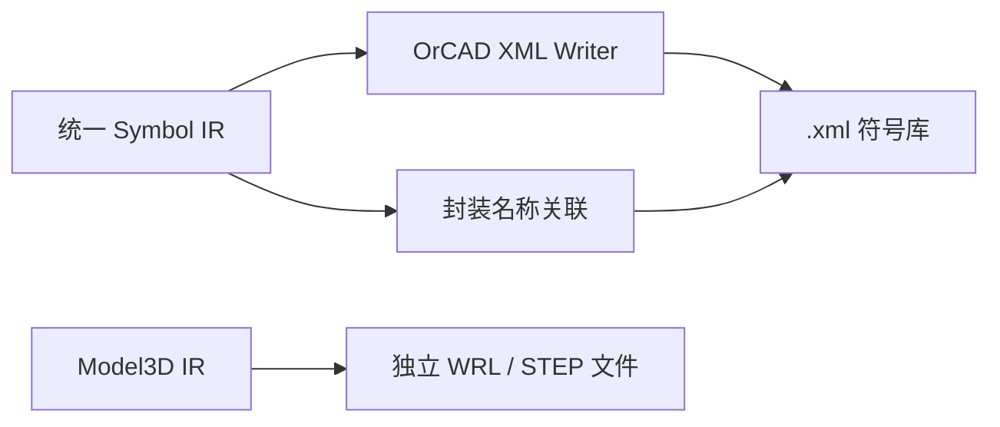

# OrCAD Capture XML 符号库导出

当前功能支持 **EasyEDA/LCSC → OrCAD Capture XML 符号库**，输出公开可读的 XML 交换文件，不直接生成 Capture 私有二进制 `.olb`。

## 输出范围

- 符号：已实现矩形、折线、引脚、位号、值和多部件数量元数据。
- 引脚：输出名称、编号、位置、方向、长度、显示状态和基础电气类型。
- 封装关联：将 `SymbolComponentIR::footprintName` 写入 `Package/@pcbFootprint`。
- 三维模型：由通用 3D 阶段独立输出；OrCAD XML 不伪造未经验证的 3D 关联。
- PCB 封装几何：不属于 Capture XML 符号库，必须选择另一个支持的 PCB 库目标单独导出。

## 使用和限制

GUI 目标格式为 `OrCAD Capture`，CLI 使用 `--target-format orcad`。输出文件扩展名为 `.xml`。追加、更新和重试模式会被拒绝，以避免破坏 XML 库结构。

用户需要在目标 OrCAD Capture 版本中使用其 XML 导入或转换流程生成 `.olb`。当前开发环境没有安装 Capture，因此本项目只完成 XML 结构回读测试，未完成官方软件打开、保存和再次读取验证。

当前 writer 对无法确认的椭圆、圆弧、图片、文本框、复杂路径和多边形不做静默丢弃，而是返回失败诊断。引脚 `type` 映射依据公开样本中的 Capture XML 字段语义实现，仍需在官方 Capture 中验证各版本的完整电气类型枚举。

## 验证

- `tests/unit/test_orcad_exporter.cpp` 验证 XML 回读、符号到封装名称关联、重复名称和不支持图元诊断。
- 未使用真实网络或本地商业软件。
- 当前验证等级为内部 serializer 和 XML parser 回读；不是官方 OrCAD 兼容性证明。

相关英文文档：[OrCAD Capture XML Symbol Export](ORCAD_EXPORT_en.md)。
