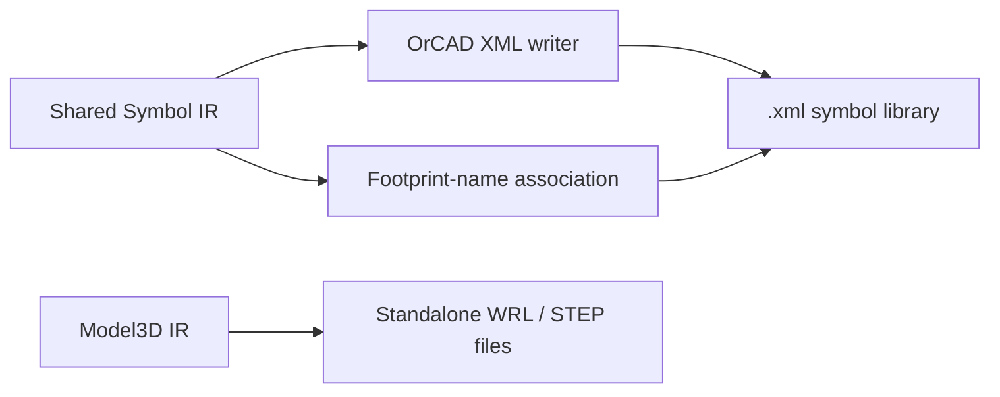

# OrCAD Capture XML Symbol Export

The current implementation supports **EasyEDA/LCSC to an OrCAD Capture XML symbol library**. It writes a readable XML exchange file and does not claim to generate Capture's private binary `.olb` database.

## Output scope

- Symbols: rectangles, polylines, pins, reference/value fields, and multipart metadata are implemented.
- Pins: name, number, position, direction, length, visibility, and basic electrical type are emitted.
- Footprint association: `SymbolComponentIR::footprintName` is written to `Package/@pcbFootprint`.
- 3D models: the common 3D stage emits standalone WRL/STEP files; the XML does not invent an unverified native association.
- PCB footprint geometry: it is not part of the Capture XML symbol library and must be exported separately to a supported PCB-library target.

## Usage and limitations

The GUI target is `OrCAD Capture`; the CLI uses `--target-format orcad`. The output extension is `.xml`. Append, update, and retry modes are rejected so an existing XML library is not silently rewritten with incompatible semantics.

Users must use the XML import or conversion workflow provided by their OrCAD Capture version to create an `.olb`. Capture is not installed in the development environment, so only local XML round-trip validation has been completed; official open, save, and reread validation remains outstanding.

Unsupported or unverified ellipse, arc, image, text-frame, complex-path, and polygon data is rejected with a diagnostic instead of being silently discarded. Pin `type` mapping follows the field semantics observed in public Capture XML samples, but the complete electrical-type enumeration still requires validation in the target Capture version.

## Verification

- `tests/unit/test_orcad_exporter.cpp` covers XML rereading, symbol-to-footprint-name association, duplicate names, and unsupported-geometry diagnostics.
- Tests use local data only and do not require network access or commercial software.
- The current verification level is internal serialization plus XML-parser rereading; it is not proof of official OrCAD compatibility.

Chinese documentation: [OrCAD Capture XML 符号库导出](ORCAD_EXPORT.md).
