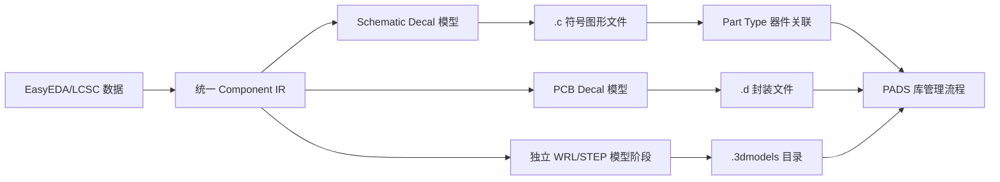

# PADS ASCII 库导出

当前功能支持 **EasyEDA/LCSC → PADS Parts Library ASCII Schematic Decal、Part Type 与 PCB Decal**，并可通过独立三维阶段输出 WRL/STEP 文件。它不是 PADS 原生二进制库，也不是包含全部高级逻辑属性的完整 PADS 元件库导出器。

## 导出边界



导出器只读取统一 IR，不重新解析 EasyEDA JSON，也不复用 KiCad、Altium 或 Xpedition 的最终写入逻辑。当前使用 PADS ASCII Parts Library 规范中的英制 mil 坐标（文件头单位标识为 `I`）。

## 当前已实现

- GUI 目标格式：`PADS PCB`。
- CLI 目标格式：`--target-format pads`。
- 符号阶段输出 PADS ASCII Schematic Decal（`.c`）和 Part Type（`.p`），支持基本图元、文本、引脚、多部件拆分以及符号到封装的关联。
- 一个输出目录中为每个封装生成一个经过安全清洗的 `<name>.d` 文件。
- 圆形、方形、矩形、椭圆和基本走线/矩形/区域图元。
- SMD 与 PTH Pad 栈；PTH 会写入顶层和底层记录，并保留钻孔及镀层标志。
- 清洗后名称冲突、空编号、非法坐标和非 ASCII 编号/文本会阻止导出并返回诊断。
- 每个 Decal 文件包含头部、时间戳、图元、文本、端子和 Pad 栈记录。

## 明确限制

- 当前不支持独立机械孔、圆弧、RoundRect、Trapezoid、Polygon 自定义 Pad 的无损输出；遇到这些数据会失败并给出诊断，不会静默退化。
- PADS Part Type 当前按符号的 `footprintName` 生成封装关联，并按符号部件生成 Gate 和引脚映射；复杂的替代封装、门交换和标准电源网络仍需用户在 PADS 中补充。
- PADS PCB Decal 不写入原生 3D 模型关联；`--3d-model` 会由独立阶段输出 WRL/STEP 文件，并保留独立文件清单语义。
- 尚未实现 PADS 完整 Part/Logic 库、多文件索引或现有 PADS 库更新/追加。
- 现有输出目录的 `no-overwrite`、`update-mode` 和 `retry-mode` 不会伪装成安全合并；这些模式会被导出阶段拒绝。
- 当前环境没有安装 PADS 软件，因此只完成文本结构、文件生成和引用数量的自动化验证，未完成 PADS 实机打开、保存和回读验证。

## 验证来源和使用方式

导出格式依据 [PADS Parts Library ASCII 规范](https://www.freecalypso.org/pub/CAD/PADS/pdfdocs/Plib_ASCII.pdf) 实现，重点包括 Schematic Decal 的 `*PADS-LIBRARY-SCH-DECALS-V9*` 文件头、基本图元和端子，以及 PCB Decal 的 `CIRCLE`/`OPEN`/`CLOSED` 图元、`T` 端子和 `PAD` Pad 栈记录。实现没有复制第三方项目代码。

GUI 中选择 `PADS PCB` 后可选择符号、封装和独立 3D 文件导出；CLI 使用：

```text
easykiconverter --target-format pads ...
```

生成的 `.c`、`.p`、`.d` 和 `.3dmodels` 需要由用户按照目标 PADS 版本的库管理流程导入或关联。请在目标软件中确认层语义、文本编码、制造属性和 Part Type 引脚映射；本项目不宣称跨版本的 PADS 原生兼容性。

## 测试

`tests/unit/test_pads_exporter.cpp` 使用本地 IR fixture 验证 Schematic Decal、Part Type 的多部件符号、引脚、封装关联和结束记录，以及 PCB Decal 的 mil 单位头、SMD/PTH Pad 栈、清洗名称冲突和不可无损表达数据的失败诊断。测试不访问网络，也不依赖本地安装的 PADS 软件。
