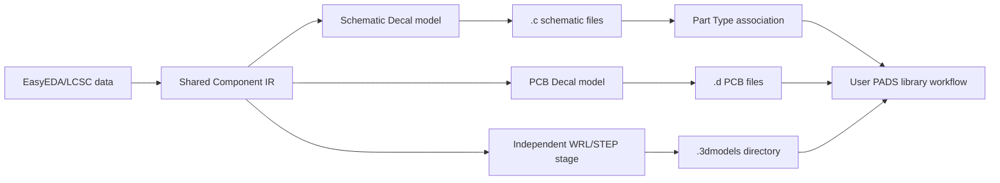

# PADS ASCII Library Export

The current feature supports **EasyEDA/LCSC to PADS Parts Library ASCII Schematic Decal, Part Type, and PCB Decal** export, with independent WRL/STEP model output. It is not a PADS native binary library or a complete PADS component-library exporter with all advanced logic attributes.

## Export boundary



The exporter consumes the shared IR and does not parse EasyEDA JSON again or reuse KiCad, Altium, or Xpedition final writers. Coordinates are emitted in imperial mils, with `I` as the file-header unit marker.

## Implemented

- GUI target: `PADS PCB`.
- CLI target: `--target-format pads`.
- The symbol stage writes PADS ASCII Schematic Decals (`.c`) and Part Types (`.p`) with basic graphics, text, pins, multipart splitting, and symbol-to-package associations.
- One sanitized `<name>.d` file per footprint in the output directory.
- Circle, square, rectangle, oval, and basic track/rectangle/region primitives.
- SMD and PTH pad stacks; PTH pads contain top and bottom records with drill and plating information.
- Sanitized-name collisions, empty pin numbers, invalid coordinates, and non-ASCII pin/text values stop export with diagnostics.
- Each Decal contains a header, timestamp, primitives, text, terminals, and pad-stack records.

## Explicit limitations

- Independent mechanical holes, arcs, RoundRect, Trapezoid, and custom Polygon pads are not emitted losslessly. Export fails with a diagnostic instead of silently degrading them.
- Part Type output uses the symbol `footprintName` for package association and emits one gate and pin mapping per symbol part. Alternate packages, gate swapping, and standard power-net definitions still require completion in PADS.
- PCB Decals do not contain native 3D associations. `--3d-model` emits WRL/STEP files through the independent model stage and keeps the output as standalone files.
- Complete PADS Part/Logic libraries, multi-file indexes, and updates/appends to existing PADS libraries are not implemented.
- `no-overwrite`, `update-mode`, and `retry-mode` are rejected by the export stage rather than being presented as safe merges.
- PADS is not installed in the current environment. Automated validation covers text structure and file generation only; no PADS open/save/read-back validation has been performed.

## Format basis and usage

The implementation follows the [public PADS Parts Library ASCII specification](https://www.freecalypso.org/pub/CAD/PADS/pdfdocs/Plib_ASCII.pdf), including the Schematic Decal `*PADS-LIBRARY-SCH-DECALS-V9*` header, basic graphics and terminals, and the PCB Decal header, `CIRCLE`/`OPEN`/`CLOSED` primitives, `T` terminals, and `PAD` pad-stack records. No third-party project source code was copied.

Select `PADS PCB` in the GUI or use:

```text
easykiconverter --target-format pads ...
```

Import or associate the generated `.c`, `.p`, `.d`, and `.3dmodels` outputs through the library workflow of the target PADS version. Confirm layer semantics, text encoding, manufacturing attributes, and Part Type pin mapping in that software; this project does not claim cross-version PADS native compatibility.

## Tests

`tests/unit/test_pads_exporter.cpp` uses a local IR fixture to verify multipart Schematic Decals and Part Types, pins, package associations, end records, the PCB Decal mil unit header, SMD/PTH pad stacks, sanitized-name collisions, and failure diagnostics for data that cannot be represented losslessly. The tests do not access the network or require a local PADS installation.
