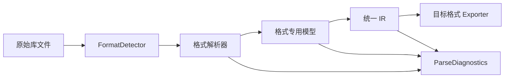
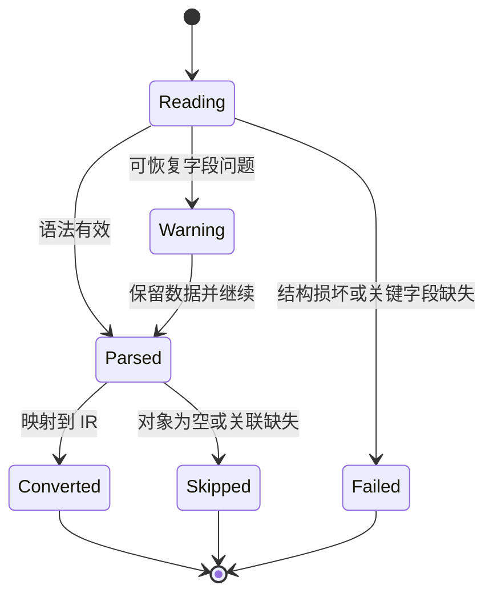

# 格式解析架构与能力边界

本文说明 EasyKiConverter 当前的格式解析基础设施，以及后续接入 Xpedition、Cadstar、P-CAD、gEDA 和 TinyCAD 时必须遵守的边界。本文不代表尚未实现的格式已经可导入。

## 当前解析链

现有 EasyEDA 数据通过 EasyEDA 专用导入器转换为模型，再由 IR 转换器生成统一中间表示；Altium 当前主要提供库读取器与导出器，Xpedition 当前提供 IR 到 ASCII/ZIP 的导出器。新的文本格式解析器必须保持以下数据流：

解析器不得直接调用目标格式写入器，也不得把格式特有字段静默丢弃。

## 已实现的通用基础设施

`src/core/parser/` 当前提供：

- `TextTokenizer`：保留行列、引号和括号位置的词法单元。
- `IndentedSectionParser`：解析 Xpedition HKP 等点缩进文本为 Section Tree，并将 XY 节点的无层级坐标续行合并到原节点。
- `DelimitedSectionParser`：解析 Cadstar 等使用 `END*` 终止符的分段文本。
- `SExpressionParser`：解析嵌套列表、引号原子和括号错误。
- `StrictNumberParser`：拒绝非法数字和非有限浮点数，并写入字段级诊断。
- `UnitConverter`：将 mm、mil、inch 转换为 IR 使用的毫米单位。
- `CoordinateTransform`：统一处理原点、旋转和镜像。
- `FormatDetector`：根据扩展名和内容头部给出保守的格式判断。
- `ParseDiagnostics`：支持 info、warn、error、skip，以及文件、器件、符号、封装和字段范围。

这些组件只负责语法、位置和通用几何语义，不负责猜测具体格式的业务字段。

## 诊断和降级规则

使用 `parseFloat(value) || 0` 一类逻辑会把损坏数据伪装成有效零值，因此禁止在新解析器中使用。非法数值必须记录字段、行号和原始文本；未知图元必须记录跳过原因，必要时保留原始字段或扩展 IR。

HKP 的 Pad、孔几何不依赖子节点顺序；XY 坐标支持括号、逗号或空格分隔。多点中任一点非法都会记录错误，即使保留其他合法点也不会伪装成无错误结果。重复定义会保留稳定后缀并建立原始名称候选表；引用原始名称存在多个候选时报告错误并停止关联，禁止静默绑定到第一个定义。

## 格式状态

### 当前已实现

- EasyEDA/LCSC API 数据：已有 EasyEDA 专用导入器和模型到 IR 的转换路径。
- Altium SchLib/PcbLib：已有 OLE/CFB 读取器以及 SchLib/PcbLib 导出器，读取器不等同于完整源格式到 IR 的 Importer。
- Xpedition：已有 IR 到符号文本和 Pads/Cell HKP ZIP 的导出器；本轮已能将 Pad、Hole、Padstack、Cell、Pin、Outline 和 PDB 器件关联解析为格式专用模型，但尚未完成 HKP 到 IR 的完整导入。

### 进行中的工作

- Xpedition ASCII/HKP：继续补充符号图元、多文件合并和格式专用模型到 IR 的映射。
- 多文件合并：采用全局名称表、稳定后缀和明确的缺失关联诊断。
- 真实样本驱动测试：每个格式至少覆盖空文件、损坏文件、非法数字、未知图元和重复名称。

### 计划支持

- Cadstar ASCII 库：已具备 `END*` 分段树基础，尚未实现 Pad、Package、Component 和 Part 到 IR 的完整关联。
- P-CAD ASCII/S-expression：复用 S-expression 解析器，先建立格式专用模型，再映射到 IR。
- P-CAD 格式检测：使用 `.pcb` 扩展名或 `ACCEL_ASCII` 文件头识别，普通 `.lib` 文件不会被误判为 P-CAD。
- TinyCAD XML、gEDA 和 Fabmaster：需先确认其公开交换格式与当前 IR 的表达能力。

### 仅支持交换格式或暂不支持

私有、加密、依赖专有 SDK 或必须调用外部 EDA 软件的格式，不会被宣称为原生支持。若只能读取交换格式，文档和导入结果必须明确标注“交换格式支持”。

## IR 兼容原则

本轮没有修改 IR。原因是通用解析层已经可以表达结构树、诊断、单位和坐标变换；在真正把某种格式映射到 IR 时，如果发现多部件、属性、图元或关联无法表达，再通过以下顺序处理：

1. 优先扩展 IR 的稳定语义字段；
2. 对暂时不适合进入公共 IR 的字段保留原始值和来源信息；
3. 只能降级时生成对象级诊断；
4. 禁止无提示地丢弃数据。

## 验证要求

解析器测试只使用仓库内 fixture 和 Mock，不访问网络，也不依赖用户安装的 EDA 软件。格式新增后，应同时增加正常、空、损坏、缺失字段、非法数字、未知图元、多部件、重名、缺失关联、单位、旋转和镜像样本。
