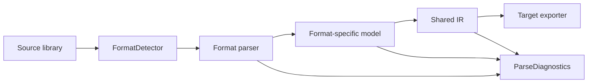
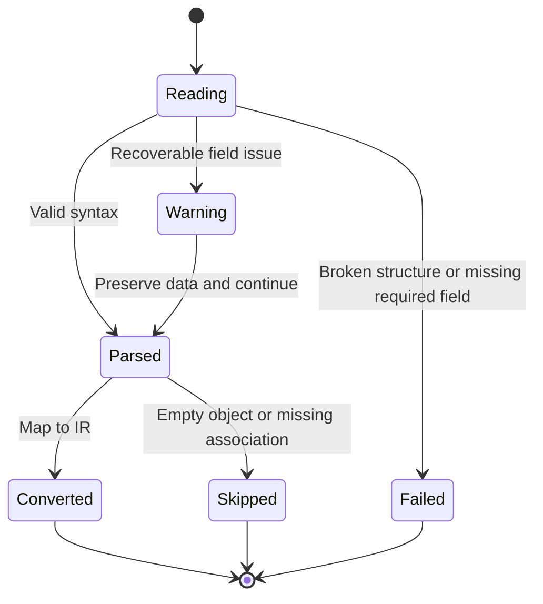

# Format Parsing Architecture and Scope

This document describes EasyKiConverter's current parsing infrastructure and the boundaries for future Xpedition, Cadstar, P-CAD, gEDA, and TinyCAD importers. It does not claim that formats listed as planned are already importable.

## Current parsing pipeline

Current EasyEDA data is handled by format-specific importers and then converted to the shared IR. Altium currently has library readers and exporters, while Xpedition currently provides IR-to-ASCII/ZIP exporters. New text parsers must preserve this flow:

Parsers must not call target writers directly or silently discard format-specific data.

## Implemented shared infrastructure

`src/core/parser/` currently provides:

- `TextTokenizer`, preserving line, column, quote, and parenthesis locations.
- `IndentedSectionParser`, which builds a Section Tree for dot-indented formats such as Xpedition HKP and joins unindented coordinate continuation lines to the preceding XY node.
- `DelimitedSectionParser`, which builds a section tree for Cadstar-style `END*` terminators.
- `SExpressionParser`, supporting nested lists, quoted atoms, and malformed parentheses diagnostics.
- `StrictNumberParser`, rejecting invalid and non-finite numbers with field-level diagnostics.
- `UnitConverter`, converting mm, mil, and inch values to the millimetres used by the IR.
- `CoordinateTransform`, applying origin, rotation, and mirror operations consistently.
- `FormatDetector`, using conservative extension and content-header detection.
- `ArchiveInspector`, inspecting ZIP central directories for traversal, symlink, encryption, and archive-bomb limits without extracting files.
- `EncodingDetector`, detecting BOM and UTF-8 and providing a diagnosable, limited Latin-1 fallback for otherwise unclassified text.
- `ImporterRegistry`, selecting a format importer in registration order without owning format-specific models.
- `ConversionReport`, unifying conversion status, partial progress, cancellation, and cross-file diagnostics.
- `ParseDiagnostics`, supporting info, warn, error, and skip at file, component, symbol, footprint, and field scope.

These components handle syntax, source locations, and common geometry semantics. They do not guess format-specific business fields.

Archive inspection runs before extraction. Callers must verify `ArchiveInspectionResult::safe` before passing an archive to a format reader. Encoding fallback is not a lossless guarantee; parsers should use diagnostics when deciding whether conversion may continue.

Xpedition HKP documents can be merged through `XpeditionHkpMerger`. The merger preserves source-file diagnostics, checks type and unit consistency, and assigns stable suffixes to duplicate definitions. If an original name maps to multiple definitions, it reports an error and requires the caller to resolve the association explicitly.

## Diagnostics and degradation rules

Patterns such as `parseFloat(value) || 0` disguise corrupt input as a valid zero and are forbidden in new parsers. Invalid numbers must retain the field, line, and original text in diagnostics. Unknown graphics must report why they were skipped, and their source data should be preserved or represented by an IR extension when needed.

HKP Pad and hole geometry is discovered independently of child-node order. XY coordinates accept parentheses with comma or whitespace separators. An invalid point in a multi-point value always produces an error, even when other valid points are retained. Duplicate definitions retain stable suffixes and an original-name candidate index; if an original reference has multiple candidates, parsing reports an error instead of silently binding to the first definition.

## Format status

### Currently implemented

- EasyEDA/LCSC API data: existing EasyEDA importers and model-to-IR conversion are available.
- Altium SchLib/PcbLib: OLE/CFB readers and SchLib/PcbLib exporters exist; a reader is not by itself a complete source-format importer to IR.
- Xpedition: IR-to-symbol and Pads/Cell HKP ZIP exporters exist. Pad, Hole, Padstack, Cell, Pin, Outline, and PDB associations parse into format-specific models. V54 symbol text now parses pins, graphics, text, and multi-part metadata and maps them to the existing Symbol IR through an adapter.
- Cadstar ASCII libraries: Pad, Package, Component, Part, pin-number ranges, custom pads, slots, basic graphics, unit conversion, and Footprint/Symbol IR adapters are implemented.
- Cadstar multi-file models: multiple parsed libraries can be merged while preserving source diagnostics and rejecting ambiguous cross-file references.
- P-CAD ASCII PCBs: `ACCEL_ASCII` detection, Pad Styles, Patterns, Pattern graphics, component placements, layer numbers, unit conversion, Y-axis conversion, and Pattern-to-Footprint IR adaptation are implemented.

### In progress

- Xpedition ASCII/HKP: continue with HKP multi-file merging, cross-file PDB/symbol associations, package details, and the remaining symbol primitives in the IR mapping.
- Multi-file merging: use global name tables, stable suffixes, and explicit missing-association diagnostics.
- Real-sample tests: each format should cover empty, malformed, invalid-number, unknown-primitive, and duplicate-name inputs.

### Planned

- Cadstar ASCII libraries: continue with vendor samples, additional layer semantics, and more Cadstar primitives; the current scope is limited to public ASCII exchange syntax.
- P-CAD ASCII PCBs: continue with vendor samples, board-level graphics conversion, additional Pad Styles, and layer semantics; board placements currently remain in the format-specific model.
- P-CAD detection uses the `.pcb` extension or the `ACCEL_ASCII` header; ordinary `.lib` files are not classified as P-CAD.
- TinyCAD XML, gEDA, and Fabmaster: first validate their public exchange formats against the current IR.

### Exchange-only or unsupported formats

Private, encrypted, SDK-dependent, or external-tool-dependent formats will not be advertised as native support. If only an exchange format is readable, the documentation and import result must say so explicitly.

## IR compatibility rules

This change does not modify the IR. The shared parser layer already represents structure trees, diagnostics, units, and coordinate transforms. When a real format-to-IR mapping exposes a gap, use this order:

1. Extend the IR with stable semantic fields when appropriate.
2. Preserve fields that do not yet belong in the public IR together with their source information.
3. Emit object-level diagnostics for unavoidable degradation.
4. Never discard data silently.

## Verification requirements

Parser tests use repository fixtures and mocks only. They must not access the network or depend on a locally installed EDA application. Each new format should add normal, empty, malformed, missing-field, invalid-number, unknown-primitive, multi-part, duplicate-name, missing-association, unit, rotation, and mirror samples.
