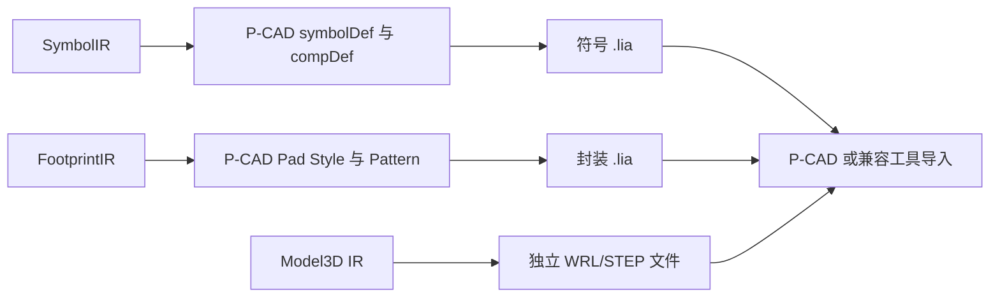

# P-CAD ASCII 封装库导出

当前功能支持 **EasyEDA/LCSC → P-CAD ASCII 原理图库和 PCB 封装库**。符号库包含 `symbolDef`、`compDef` 和可用的封装关联；PCB 库包含 Pad Style 和 Pattern；三维模型由独立阶段输出并保留为独立文件。它不等同于已经通过 P-CAD 实机验证的完整原生工程库。

## 已实现

- SMD 和通孔焊盘。
- 椭圆、圆角矩形、矩形和椭圆长圆形 Pad Style。
- 通孔孔径和镀层标志。
- 顶层、底层铜层以及默认 P-CAD 1～11 层中的常用图形层映射。
- 直线、圆、矩形、Polygon 区域和文本图元。
- 相同焊盘几何、孔径、镀层和层语义的 Pad Style 去重。
- 输出后的本地 P-CAD 解析器回读验证。
- 原理图符号的引脚、部件和器件到封装关联输出。
- 多部件符号分部件生成 `symbolDef` 并由 `compDef` 关联。

## 输出和限制

GUI 目标格式为 `P-CAD PCB`，CLI 使用 `--target-format pcad`。启用符号导出时，会额外生成 `<library>_PCAD_SCH.lia`；封装仍为 `<library>.lia`，三维模型由独立阶段输出。

当前明确拒绝以下情况，避免静默改变制造语义：

- 独立无编号安装孔。
- 槽孔、Polygon/Trapezoid 焊盘和无法映射的图层。
- 非 ASCII 的封装名称、焊盘编号和文本。
- 已存在库的更新、追加和重试模式。
- 无法无损表达的符号圆弧、椭圆、复杂路径、文本框和图片。

P-CAD ASCII 的单位字段为 `fileUnits MM`，坐标写出时使用 P-CAD 的向上为正坐标约定，旋转使用十分之一度。三维模型会被跳过并产生诊断。

## 验证范围

`tests/unit/test_pcad_exporter.cpp` 验证封装库；符号库测试验证 `symbolDef`、`compDef`、多部件引脚和封装关联记录。当前环境未安装 P-CAD 或其他官方兼容工具，因此尚未完成官方软件打开、保存和回读验证。

格式研究参考了公开 P-CAD ASCII 结构说明和 KiCad 的格式研究文档；实现基于 EasyKiConverter 的 FootprintIR 独立编写，未复制第三方源码。
