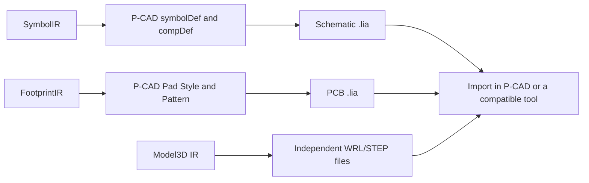

# P-CAD ASCII symbol, component, and PCB library export

The current feature supports **EasyEDA/LCSC to P-CAD ASCII schematic, component-association, and PCB libraries**. The schematic library writes `symbolDef`, `compDef`, and available footprint associations; the PCB library writes Pad Styles and Patterns; 3D models are emitted by the independent model stage. This is not a native library workflow validated in P-CAD yet.

## Implemented

- SMD and through-hole pads.
- Ellipse, rounded rectangle, rectangle, and oval Pad Styles.
- Through-hole diameter and plating flag.
- Common graphical layer mappings using the default P-CAD layers 1 through 11.
- Lines, circles, rectangles, polygon regions, and text graphics.
- Pad Style deduplication using geometry, drill, plating, and layer semantics.
- Local read-back validation with the project P-CAD parser.
- Schematic symbol pins, parts, and component-to-footprint association records.
- Multi-part symbols emitted as per-part `symbolDef` records referenced by `compDef`.

## Output and limitations

Select `P-CAD PCB` in the GUI or use `--target-format pcad` in the CLI. Symbol export additionally writes `<library>_PCAD_SCH.lia`; the PCB library remains `<library>.lia`, and 3D files are emitted by the independent model stage.

The exporter rejects independent unnumbered mounting holes, slots, polygon/trapezoid pads, unmappable layers, non-ASCII names or text, unsupported schematic curves/text frames/images, and update, append, or retry modes for an existing library. 3D models are emitted by the independent model stage with visible diagnostics.

The file declares `fileUnits MM`, writes coordinates using P-CAD's upward-positive Y convention, and stores rotations in tenths of a degree. When 3D export is enabled, the independent stage emits WRL/STEP files and reports them as standalone outputs; the P-CAD library does not receive an unverified native 3D association.

`tests/unit/test_pcad_exporter.cpp` validates the PCB library. The symbol-library tests validate `symbolDef`, `compDef`, multi-part pins, and footprint association records. P-CAD or another official compatible tool is not installed in the current environment, so official open/save/read-back validation has not been performed.

The format research used public P-CAD ASCII structure documentation and KiCad format research. The implementation is independently written against EasyKiConverter's FootprintIR; no third-party source code was copied.
