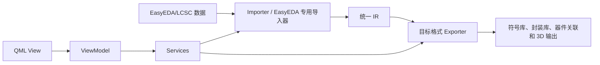
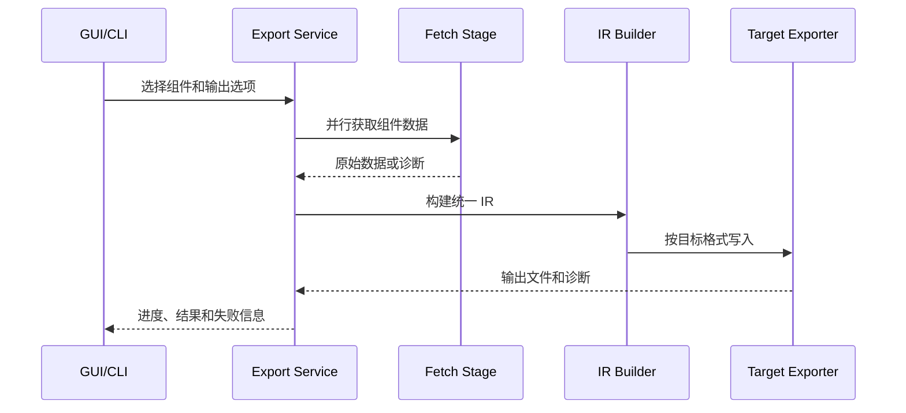

# 项目上下文

[English version](PROJECT_CONTEXT_en.md)

## 项目用途

EasyKiConverter 是 Qt 6 / C++17 桌面与 CLI 工具，获取 LCSC（嘉立创）和 EasyEDA 元件数据，经过导入、IR 构建和目标格式导出，生成符号库、封装库、器件关联文件以及可支持的 3D 模型文件。具体目标格式能力以当前导出器、GUI/CLI 路由和对应格式文档为准。

## 技术栈与入口

- GUI：Qt Quick/QML，入口在 `src/main.cpp`。
- CLI：`QCoreApplication` 和 `src/utils/cli/` 下的 `CliConverter`。
- 核心语言：C++17；脚本工具：仓库根目录 `.venv` 中的 Python。
- 构建：CMake；测试：QtTest、Qt QuickTest 和 CTest。
- 网络：所有 HTTP 请求必须通过 `src/core/network/` 的 `NetworkClient`，测试使用 Mock，不能直接访问真实网络。

## 模块边界

- `src/ui/qml/`：展示、交互、绑定和样式，不承载转换业务规则。
- `src/ui/viewmodels/`：桥接 QML 与服务，管理 UI 状态和用户操作。
- `src/services/`：导出编排、配置、缓存、网络协调和报告生成。
- `src/models/`：应用数据模型和序列化。
- `src/core/`：导入器、IR、格式导出器、网络和几何工具。
- `src/workers/`：后台获取、处理和写入任务。
- `tests/unit/`、`tests/integration/`、`tests/ui/`、`tests/benchmark/`：自动化测试分层。

## 导出流水线

导出通常分为网络预取和文件导出两个阶段。网络并发、取消、部分失败和进度由现有服务协调；新增格式应接入现有接口，不应从 QML 直接调用格式 writer。

## 能力状态

- 已实现：EasyEDA/LCSC 数据导入、统一 IR、现有 KiCad、Altium、Xpedition、Cadstar、P-CAD、PADS、Eagle、OrCAD、Allegro 等代码路径；每个目标的可发布范围必须以对应格式文档和测试为准。
- 进行中：持续完善格式解析、目标格式映射、跨平台打包和缓存安全等能力。
- 计划支持：未在源码和测试中形成完整链路的格式或商业软件原生验证，不得在贡献说明中当作已支持。

“存在导出器类”不等于完成了目标 EDA 的商业软件兼容性验证；结构测试、自动化测试和实机验证必须分别报告。

## 术语

- Importer：把来源格式解析为格式专用模型或统一 IR 的导入流程。
- IR：与来源和目标格式解耦的统一中间表示。
- Exporter：把 IR 写入某个目标格式的导出器。
- Companion file：与主库文件一起提交、且需要保持引用一致的伴随文件。
- Diagnostic：对警告、错误、跳过、取消和降级的结构化说明。
