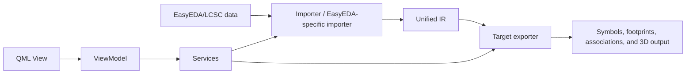
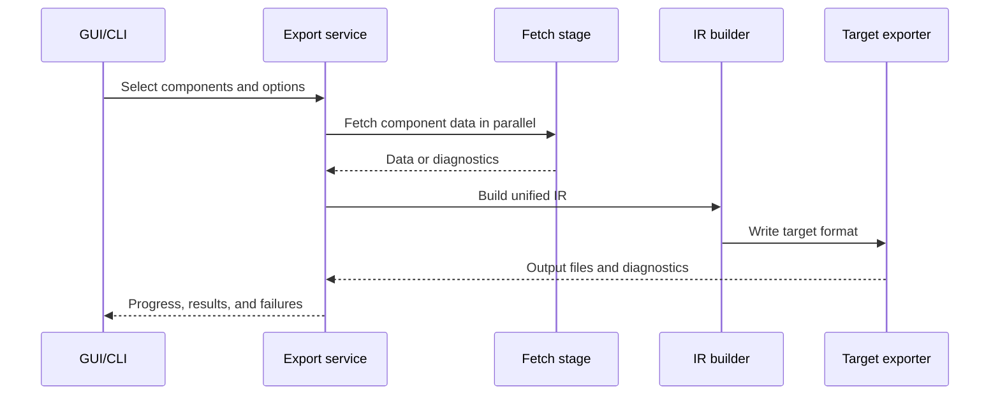

# Project Context

[中文版](PROJECT_CONTEXT.md)

## Purpose

EasyKiConverter is a Qt 6 / C++17 desktop and CLI tool that obtains LCSC and EasyEDA component data, builds a unified intermediate representation, and exports supported symbol libraries, footprint libraries, component associations, and 3D model files. The precise scope of each target format is defined by its current exporter, GUI/CLI routing, tests, and format documentation.

## Technology and entry points

- GUI: Qt Quick/QML, entered through `src/main.cpp`.
- CLI: `QCoreApplication` and `CliConverter` under `src/utils/cli/`.
- Core language: C++17; scripting tools: Python in the repository `.venv`.
- Build: CMake; tests: QtTest, Qt QuickTest, and CTest.
- Networking: all HTTP must go through `NetworkClient` under `src/core/network/`; tests use mocks and must not access the real network.

## Module boundaries

- `src/ui/qml/`: presentation, interaction, bindings, and styles; no conversion business rules.
- `src/ui/viewmodels/`: bridges QML and services and owns UI state.
- `src/services/`: export orchestration, configuration, cache, network coordination, and reports.
- `src/models/`: application data models and serialization.
- `src/core/`: importers, IR, format exporters, networking, and geometry utilities.
- `src/workers/`: background fetch, processing, and write tasks.
- `tests/unit/`, `tests/integration/`, `tests/ui/`, and `tests/benchmark/`: automated test layers.

## Export pipeline

Exports normally have a network preload phase and a file export phase. Existing services own concurrency, cancellation, partial failure, and progress. A new format should use the existing interfaces rather than calling a format writer from QML.

## Capability status

- Code contains implementation entry points for EasyEDA/LCSC import, the unified IR, and partial target paths for KiCad, Altium, Xpedition, Cadstar, P-CAD, PADS, Eagle, OrCAD, Allegro, and other targets. These entry points do not automatically mean publishable support.
- In progress: format parsing, target mapping, cross-platform packaging, and cache safety improvements.
- Planned: formats or native-tool validation that do not yet have a complete source-to-output path in code and tests. Do not describe them as supported in contributions.

Before calling a format “supported”, check the relevant importer/exporter implementation, automated tests, capability documentation, and any record of validation in the commercial EDA application. The existence of an exporter class is not proof of compatibility. Structural tests, automated tests, and real-tool validation must be reported separately.

## Terms

- Importer: a source-format parsing path that produces a format-specific model or unified IR.
- IR: a source- and target-independent intermediate representation.
- Exporter: a writer that converts IR into a target format.
- Companion file: an additional file committed with a main library file whose references must remain consistent.
- Diagnostic: structured information about warnings, errors, skips, cancellation, and degradation.

## Evidence priority

When source, documentation, issues, or plans disagree, use this order:

1. Source and tests on the current branch.
2. Current workflow configuration and actual CI results.
3. Current format, architecture, and build documentation.
4. Reproductions and conclusions confirmed in Issues or PRs.
5. Roadmaps and other planning material.

Lower-priority material cannot override higher-priority facts. Reports must identify the branch and commit to which their conclusions apply.
